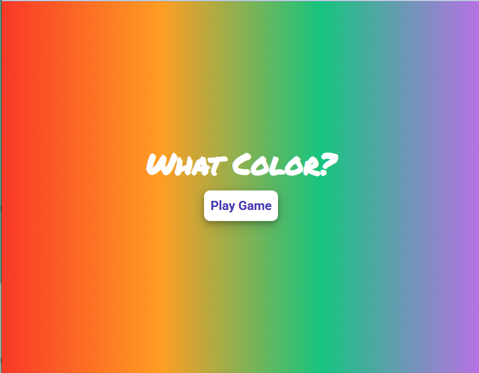

# Color Guessing Game

## Overview

This is project is for promotion into stage 2 for the HNG Internship Cohort 12. It is  a Color Matching game called **What Color?** made with ReactJS. This task is dives into game design and functionality.

## Features

- **Responsive Design:** Built with Mobile-first responsive design.
- **Game Functionality:** Match color circles to appropriate color.

## Installation

1. lone the repository: ```javascript git clone https://github.com/Nkwor-Jane/what_color.git```
2. Navigate to the project: ```javascript cd what_color```
3. Install dependencies:```javascript npm install```

## Usage

1. Start the development server: ```javascript npm run dev```

2. Open your browser and navigate to: ```javascript http://localhost:5173/```

## Screenshots

- Homepage View


- Game View


## Live Demo

Check out the live demo [here](https://janematchcolourgame.netlify.app/)

## Contributing

Feel free to clone and fork this repository. You can also submit pull requests. Any contributions are welcome!

## Acknowledgements

- [HNG](https://hng.tech/internship) for organizing this internship.
- I truly appreciate the mentors and managers for their contributions and guidance towards the successful completion of this task.

Feel free to customize it further to fit your needs! If you have any specific details you'd like to add or change, let me know.
